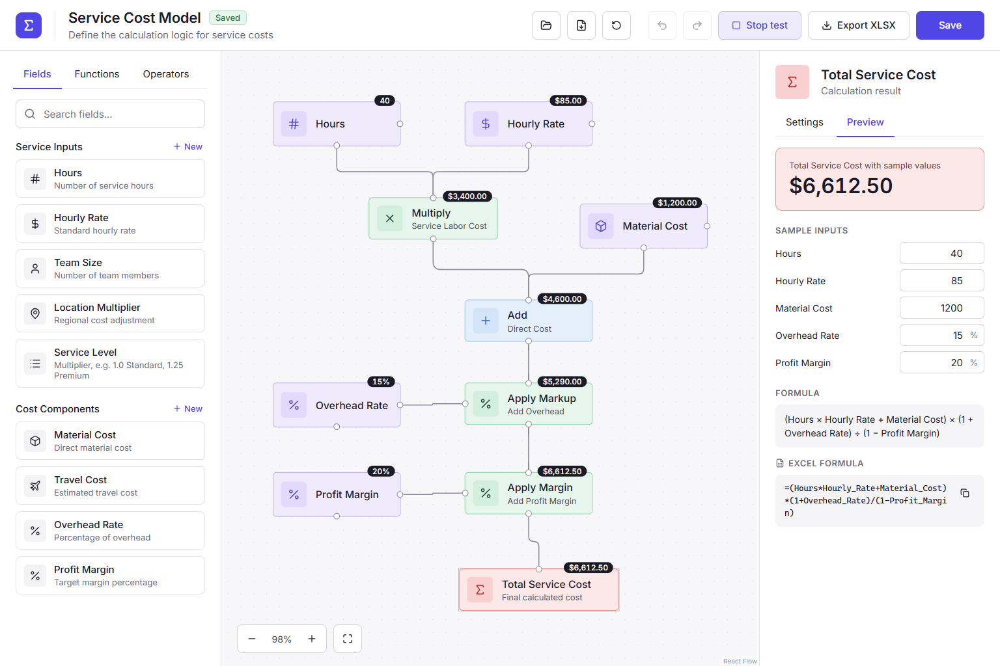

# Service Cost Model: User Guide

Service Cost Model lets you build a cost calculation by connecting boxes on a canvas, check it with sample
numbers, and export it to Excel as a live formula.



## Contents

1. [Getting started](#getting-started)
2. [The screen](#the-screen)
3. [Building a formula](#building-a-formula)
4. [Node reference](#node-reference)
5. [Markup vs margin](#markup-vs-margin)
6. [Fields](#fields)
7. [Testing your model](#testing-your-model)
8. [Exporting to Excel](#exporting-to-excel)
9. [Saving and sharing models](#saving-and-sharing-models)
10. [Keyboard shortcuts](#keyboard-shortcuts)
11. [Troubleshooting](#troubleshooting)

## Getting started

1. Download `Service-Cost-Model.html` from the
   [latest release](https://github.com/tkdaymond/service-cost-model/releases/latest).
2. Double-click the file. It opens in Chrome or Edge. Nothing is installed and no internet connection is needed.
3. The app starts with a ready-made service cost model:

   ```
   Total = (Hours × Hourly Rate + Material Cost) × (1 + Overhead Rate) ÷ (1 − Profit Margin)
   ```

   Change it, or use it as an example for your own.

The app works on a desktop or laptop screen (at least 1100 pixels wide). It is not designed for phones.

## The screen

| Area | What it does |
|---|---|
| **Header** | Model name and status (**Draft** = unsaved changes, **Saved**), and the main buttons. |
| **Left panel** | The building blocks, in three tabs: **Fields**, **Functions** and **Operators**. |
| **Canvas** | Where you arrange and connect the blocks. Zoom controls are in the bottom-left corner. |
| **Right panel** | **Settings** for whatever is selected, and a **Preview** of the result and formula. |

Header buttons, from left to right:

| Button | Action |
|---|---|
| Folder icon | **Open** a model file (`.costmodel.json`). |
| File icon | **Download model** as a file you can share. |
| Circular arrow | **Reset** to the default template (can be undone). |
| Undo / Redo | Step backwards or forwards through your changes. |
| **Test** | Shows the value at every step of the calculation. |
| **Export XLSX** | Downloads an Excel workbook containing the formula. |
| **Save** | Saves the model in this browser. |

## Building a formula

A model is a chain of boxes (called **nodes**) joined by lines (called **connections**). Values flow from the
top of the canvas down to the red **result** node at the bottom.

**Add a node:** drag it from the left panel onto the canvas, or double-click it in the list to place it in free
space near the middle of the canvas.

**Connect two nodes:** every node has small circles on its edges, called **handles**. Drag from an output handle
(bottom, or the right side of a field) to an input handle on another node (top, or the left side of a percentage
node).

- An input that takes a single value, such as the A input of Subtract, replaces its old connection when you
  connect something new.
- The app won't let you create a loop, where a value would depend on itself.

**Move a node:** drag it. **Select** a node by clicking it; its settings appear in the right panel.

**Delete:** select a node or a connection and press **Delete** or **Backspace**, or use the
**Remove from canvas** button in the right panel. The result node can't be deleted.

**Navigate:** scroll or pinch to zoom, drag empty canvas to pan, and use the zoom buttons (−, +, the percentage
to reset to 100%, and the frame icon to fit everything on screen).

**Rename the model:** click an empty part of the canvas. The right panel then shows the model's name and
description.

## Node reference

Colours on the canvas tell node types apart: purple for inputs, green and blue for calculations, amber for
functions, grey for constants, and red for the result.

### Operators

| Node | Inputs | Result |
|---|---|---|
| **Add** | Two or more, on the top handle | The sum of all inputs |
| **Subtract** | **A** (top left) and **B** (top right) | A − B |
| **Multiply** | Two or more, on the top handle | The product of all inputs |
| **Divide** | **A** (top left) and **B** (top right) | A ÷ B |
| **Apply Markup** | **Base** (top) and **Rate** (left) | Base × (1 + Rate) |
| **Apply Margin** | **Base** (top) and **Rate** (left) | Base ÷ (1 − Rate) |
| **Constant** | None | A fixed number you type in its settings |

For Subtract, Divide and the percentage nodes, the handle labels (A, B, Base, Rate) are shown until the
handle is connected.

### Functions

| Node | Inputs | Result |
|---|---|---|
| **Min** | Two or more | The smallest input. Useful as a price cap: MIN(cost, cap). |
| **Max** | Two or more | The largest input. Useful as a minimum charge: MAX(cost, minimum). |
| **Round** | One | The input rounded to a number of decimals, set in its settings. Use a negative number to round to tens (−1), hundreds (−2) and so on. |

Rounding works exactly like Excel's ROUND: halves round away from zero.

### Result

The red node is the final answer. Its settings control:

- **Name** and **Description**: used as the result's label in the Excel export.
- **Format**: Currency (USD), Number or Percent.
- **Decimal places**: 0 to 6.

Each operator and function node also has a **Title** and **Subtitle** you can change, for example
"Multiply / Service Labor Cost", so the canvas reads like a description of your calculation.

## Markup vs margin

Percentages can be applied in two ways, and they give different answers.

- **Markup** adds a percentage *of the cost*: `Base × (1 + Rate)`. Use it for overhead, contingency or a markup.
- **Margin** sets the profit as a percentage *of the final price*: `Base ÷ (1 − Rate)`. Use it for profit margin.

Example with a $1,000 cost and 20%:

| Method | Price | Profit | Profit as a share of the price |
|---|---|---|---|
| Markup | $1,200.00 | $200.00 | 16.7% |
| Margin | $1,250.00 | $250.00 | **20%** |

If you quote with a "20% margin" but calculate it as a markup, you actually earn 16.7%.

Percentages are applied one after another, in the order they are connected. The default model applies
overhead first (so overhead is charged on the direct cost), then profit margin (so profit is earned on the full
cost including overhead).

You can switch a percentage node between the two modes in its settings. A margin must be below 100%: at 100%
the price would be infinite.

## Fields

Fields are the inputs to your formula, such as Hours or Hourly Rate. The app starts with nine:

- **Service Inputs:** Hours, Hourly Rate, Team Size, Location Multiplier, Service Level
- **Cost Components:** Material Cost, Travel Cost, Overhead Rate, Profit Margin

Service Level is a number used as a multiplier, for example 1.0 for Standard and 1.25 for Premium.

**Create a field:** click **+ New** next to a group heading in the Fields tab.

**Edit a field:** click it in the Fields list, or select it on the canvas. You can change:

| Setting | Notes |
|---|---|
| **Name** | Shown on the canvas and in Excel. The app warns you if another field has the same name. |
| **Description** | Shown in the Fields list and in the Excel export. |
| **Type** | **Number**, **Currency** or **Percent**. This controls how values are displayed and formatted in Excel. |
| **Sample value** | The value used for testing and placed in the Excel input cell. Enter percentages as whole numbers: type 15 for 15%. |
| **Group** | Pick an existing group or type a new name to create one. |
| **Icon** | Purely visual. |

The panel also shows the field's **Excel name**, the name its cell gets in the exported workbook (see
[Exporting to Excel](#exporting-to-excel)).

A field can appear on the canvas more than once. Changes to the field apply everywhere it is used.

**Delete a field:** use **Delete field** at the bottom of its settings. If the field is on the canvas, those nodes
are removed too, after you confirm. To remove just one appearance from the canvas, select that node and use
**Remove this node from canvas** instead.

## Testing your model

Click **Test** in the header. Every node then shows a small label with its value, calculated from the fields'
sample values, and the right panel switches to **Preview**, which shows:

- the result with the sample values;
- **Sample inputs**: the values of every field the formula uses, which you can change here;
- the **Formula** in plain language and the **Excel formula** (with a copy button);
- any **Issues** (see [Troubleshooting](#troubleshooting)). Click an issue to select the node it refers to.

Click **Stop test** to hide the value labels.

## Exporting to Excel

Click **Export XLSX**. The workbook has one sheet, **Model**, containing:

- a row for each field **used by the formula**, with its value in a **yellow input cell**;
- the **result cell** (highlighted in red) containing the live formula;
- the formula in plain language and as Excel text, for reference.

Change any yellow cell in Excel and the result updates automatically.

Each input cell has a name, so the formula reads like a sentence, for example:

```
=(Hours*Hourly_Rate+Material_Cost)*(1+Overhead_Rate)/(1-Profit_Margin)
```

Excel names can't contain spaces or most symbols, so the app converts them: `Hourly Rate` becomes
`Hourly_Rate`, and `%` becomes `Pct`. A name that Excel would mistake for a cell address, like `Tax2024`, gets
an underscore added (`Tax2024_`). The exact name is shown in each field's settings.

A cell that feeds a margin only accepts values from 0% to just below 100%; Excel rejects anything else.

Export is blocked while the model has errors, or while a sample value makes the result impossible (such as a
100% margin). A message tells you what to fix.

## Saving and sharing models

**Save** (or Ctrl+S) stores the model in *this browser on this computer*. It reopens automatically next time.
The header shows **Draft** when there are unsaved changes, and the browser asks for confirmation if you try to
close the tab with unsaved changes.

Only one model is saved at a time. To keep several, or to share one, use model files:

- **Download model** (file icon) saves `<model name>.costmodel.json`.
- **Open** (folder icon) loads one. It replaces the current model; you can undo this.

To share a model with a colleague, send them the `.costmodel.json` file (and the app, if they don't have it).
After opening it, they should click **Save** to keep it in their browser.

To share only the result, send the exported `.xlsx` file. It works in Excel without the app.

## Keyboard shortcuts

| Keys | Action |
|---|---|
| Ctrl+Z | Undo |
| Ctrl+Y or Ctrl+Shift+Z | Redo |
| Ctrl+S | Save |
| Delete or Backspace | Delete the selected node or connection |

Typing into one box counts as a single change, so one Undo reverts the whole edit. Undo and Redo don't act
while you are typing in a box, so the box's own undo works there.

## Troubleshooting

Problems are shown in red: the node gets a dashed red border and a warning icon, and the issue is listed in the
Preview tab. Hover over a node to see its message.

| Message | What to do |
|---|---|
| *… is missing its … input* | Connect something to the named input (A, B, Base, Rate, or the top handle). |
| *… needs at least 2 inputs* | Add, Multiply, Min and Max need two or more connections on their top handle. |
| *This node is part of a loop* | Remove a connection so no value depends on itself. |
| *A margin must be below 100%* | Lower the rate feeding the Apply Margin node. |
| *Division by zero* | The B input of a Divide node is zero with the current sample values. |
| *This node refers to a field that no longer exists* | Delete the node; its field was deleted. |

A **faded** node isn't connected to the result, so it doesn't affect the formula. Connect it or delete it.

**My saved model is gone.** Saved models belong to one browser. A different browser, a private window, or
clearing browsing data won't show it. Keep important models as `.costmodel.json` files.

**"Could not open the file"** means the file isn't a Service Cost Model file, is damaged, or was made by a newer
version of the app. Download the [latest release](https://github.com/tkdaymond/service-cost-model/releases/latest).
